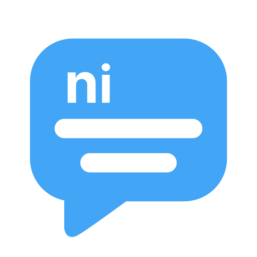

<br>
<div align="center">

</div>
<br>

# Nimbrung
Chat application with Flutter + Firebase

## Table of Contents
- [Features](#features)
- [Tools Version](#tools-version)
- [Installation](#installation)

## Features
1. Chat message
2. Emoji
3. Profile
4. Online Status
5. Dark Mode
6. Push Notification

## Tools Version

Flutter 3.10.4 • channel stable • https://github.com/flutter/flutter.git </br>
Tools • Dart 3.0.3 • DevTools 2.23.1 </br>

## Installation

**Step 1:**

Download or clone this repo by using the link below:

```
https://github.com/kouseina/chat-app.git
```

**Step 2:**

Go to project root and execute the following command in console to get the required dependencies: 

```
flutter pub get 
```